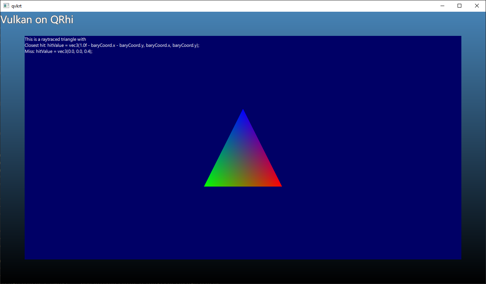

Demo of using VK_KHR_ray_tracing_pipeline, VK_KHR_VK_KHR_acceleration_structure, etc. in a Vulkan-based Qt Quick application.

The Vulkan image that we render into using raytracing is then wrapped in a
QSGTexture and is used to texture a quad for a custom QQuickItem exposed to
QML. (this is a good example of how to do any custom Vulkan rendering in a
texture and use the texture with an Item, this part is fairly similar to the
https://doc-snapshots.qt.io/qt6-dev/qtquick-scenegraph-vulkantextureimport-example.html
example)

The result is the classic triangle, based on
https://github.com/SaschaWillems/Vulkan/blob/master/examples/raytracingbasic/raytracingbasic.cpp
and https://nvpro-samples.github.io/vk_raytracing_tutorial_KHR/
although modified here and there.

QRhi's double buffering (2 frames in flight) is handled more or less correctly,
and the window should also resize without breaking. Some resources are not
cleaned up, hence the validation layer warnings when exiting.

Needs an NVIDIA RTX card, recent drivers, a recent Vulkan SDK, and a patched Qt
dev (6.2), although 6.1 might work too. In any case,
qtbase/src/gui/rhi/qrhivulkan.cpp needs to be patched since there is no other
way to enable the extra features on the VkDevice:

```
-        devInfo.pEnabledFeatures = &features;
+
+        // ###
+        VkPhysicalDeviceBufferDeviceAddressFeatures enabledBufferDeviceAddresFeatures = {};
+        VkPhysicalDeviceRayTracingPipelineFeaturesKHR enabledRayTracingPipelineFeatures = {};
+        VkPhysicalDeviceAccelerationStructureFeaturesKHR enabledAccelerationStructureFeatures = {};
+        enabledBufferDeviceAddresFeatures.sType = VK_STRUCTURE_TYPE_PHYSICAL_DEVICE_BUFFER_DEVICE_ADDRESS_FEATURES;
+        enabledBufferDeviceAddresFeatures.bufferDeviceAddress = VK_TRUE;
+
+        enabledRayTracingPipelineFeatures.sType = VK_STRUCTURE_TYPE_PHYSICAL_DEVICE_RAY_TRACING_PIPELINE_FEATURES_KHR;
+        enabledRayTracingPipelineFeatures.rayTracingPipeline = VK_TRUE;
+        enabledRayTracingPipelineFeatures.pNext = &enabledBufferDeviceAddresFeatures;
+
+        enabledAccelerationStructureFeatures.sType = VK_STRUCTURE_TYPE_PHYSICAL_DEVICE_ACCELERATION_STRUCTURE_FEATURES_KHR;
+        enabledAccelerationStructureFeatures.accelerationStructure = VK_TRUE;
+        enabledAccelerationStructureFeatures.pNext = &enabledRayTracingPipelineFeatures;
+
+        VkPhysicalDeviceFeatures2 physicalDeviceFeatures2 = {};
+        physicalDeviceFeatures2.sType = VK_STRUCTURE_TYPE_PHYSICAL_DEVICE_FEATURES_2;
+        physicalDeviceFeatures2.features = features;
+        physicalDeviceFeatures2.pNext = &enabledAccelerationStructureFeatures;
+        devInfo.pNext = &physicalDeviceFeatures2;
+
+        //devInfo.pEnabledFeatures = &features;
```


